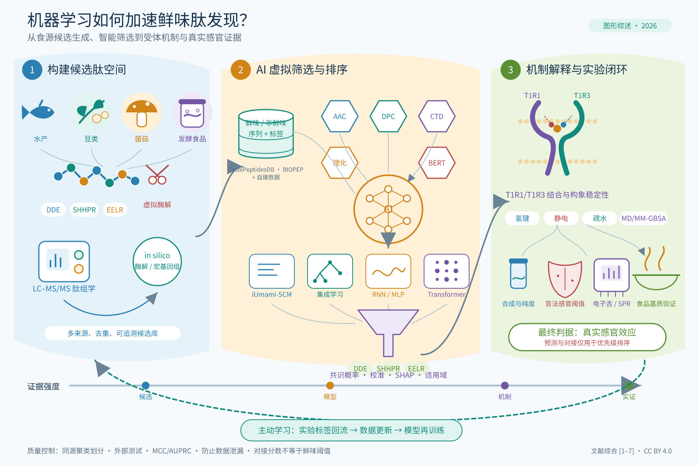

# 机器学习筛选鲜味肽——可编辑综述图



## 文件

- `ml_umami_peptide_screening.svg`：主交付物，1800 × 1200，所有文字、图标、形状和箭头均可编辑。
- `ml_umami_peptide_screening.png`：快速预览，不建议用于后续编辑。
- `generate_figure.py`：零第三方依赖的 SVG 生成源代码，内含原创食物、蛋白链、质谱、数据库、AI 网络、受体、感官与食品基质矢量图标。
- `SOURCES.md`：图中框架对应的文献与 DOI。

## 重新生成

```bash
python examples/ml-umami-peptide-review/generate_figure.py
```

## 编辑

推荐使用 Inkscape、Adobe Illustrator、Affinity Designer 或 Figma 打开 SVG。文字没有转曲；如本机没有中文字体，建议安装 Noto Sans CJK SC，或在编辑软件中替换为思源黑体/微软雅黑。

## 使用提醒

该图是一张中文期刊风格的通用综述框架。投稿前请根据目标期刊：

1. 将标题和每个阶段改成与你的综述正文一致的术语；
2. 将 `[1–7]` 替换成稿件中的真实参考文献编号；
3. 根据你的纳入文献，把示意性的候选数量替换为有出处的统计值或删除；
4. 在图注中说明缩写与“计算预测不能替代感官验证”。
